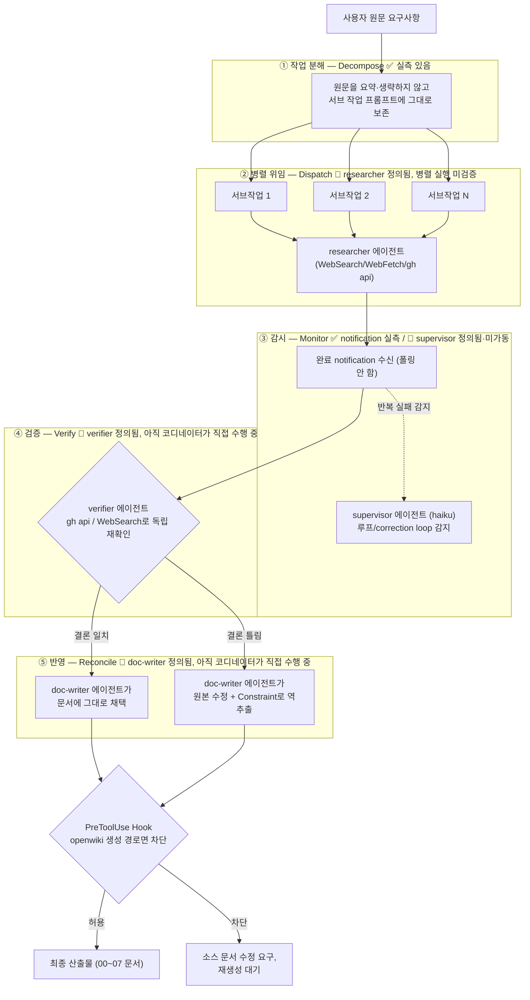

# 관리자/오케스트레이터 에이전트 패턴 — 이 세션에서 이미 검증된 것

**Status:** ACTIVE
**Layer:** 2 (설계, 실패 사례 인용부는 Layer 1) — 층 구분 기준: [CATALOG.md](../../CATALOG.md)

`04`의 ADR-8(지속상태+재시도)과 사용자가 직접 지적한 문제("병렬처리·감시·검증 역할이 없으면 하나의 작업으로 처리되어 사람보다 못한 효율")는 같은 지점을 가리킨다. 이 문서는 그 역할을 처음부터 설계하지 않는다 — **이 세션 자체가 이미 그 역할을 여러 번 실제로 수행했으므로, 먼저 일어난 일을 그대로 기록한다.**

## 핵심 한 문장

> 관리자 에이전트의 핵심은 "일을 나눠서 병렬로 맡긴다"가 아니라 **"돌아온 결과를 그대로 안 믿고 검증한 뒤에만 받아들인다"**는 것이다 — 이 세션에서 실제로 틀렸던 두 번(ADR-4의 Nessie 1순위 추천, ADR-5의 "인터페이스 라이브러리 없음" 결론)은 전부 이 검증 단계를 건너뛰어서 생겼다.

## 1. 이 세션에서 실제로 일어난 사이클들

| 위임한 작업 | 검증에서 뒤집힌 것 |
|---|---|
| OSS 레퍼런스 1차 서베이 (data lake/interface/filter/quality loop) | interface 카테고리 "라이브러리 없음" 결론 — 나중에 `gh api`로 6개 발견 |
| data lake 레퍼런스 재조사 | Nessie 1순위 추천 — 나중에 웹서치로 "Polaris에 합병 중"임을 발견, 강등 |
| filter 레퍼런스 재조사 | 없음 (PurpleLlama/portkey-ai/gateway 둘 다 직접 재검증에서 수치 일치) |
| Direction 리서치 (수익형 vs 서비스형) | 없음, 단 "레딧 없냐"는 지적으로 2차 리서치(grassroots) 추가 위임 |
| Grassroots 리서치 (Reddit/HN/dev 커뮤니티) | 없음, Reddit 자체는 검색 도구 한계로 못 가져옴 — 그 한계를 숨기지 않고 보고 |
| Edge-case/tracing/retry 리서치 | "LangGraph가 이미 채택됐다"는 fork의 전제 — 실제로는 정식 ADR로 채택된 적 없었음(§9-4 격) |

여섯 번 중 세 번에서 서브에이전트의 결론이나 전제가 틀렸다 — **부정 결론("없다")과 무비판적 전제 상속이 가장 잦은 실패 모드**였다.

## 2. 5단계 파이프라인 (역추출)

```
① 작업 분해 (Decompose)
    사용자 원문 요구사항을 요약·생략하지 않고 서브 작업 프롬프트에 그대로 보존
    (건너뛰면: "openwiki도 있고"가 누락된 사건 — 04 §5 두 번째 Never 규칙)
② 병렬 위임 (Dispatch)
    Agent(fork) 도구로 백그라운드 실행. 이 세션은 매번 순차적으로 하나씩 던졌다 —
    "동시에 여러 개"는 도구가 지원하지만 실제로 검증한 적은 없다 (§4 참고)
③ 감시 (Monitor)
    task-notification 이벤트로 완료를 통보받음 — 폴링 안 함
④ 검증 (Verify)  ← 가장 중요, 가장 자주 생략됨
    서브에이전트의 결론, 특히 부정 결론("없다")이나 순위 결론("1순위")은
    반드시 독립 도구(`gh api`, WebSearch)로 재확인한다
    (건너뛰면: Nessie/인터페이스 라이브러리 오판 — 04 §5 다섯 번째 Never 규칙)
⑤ 반영 (Reconcile)
    검증 결과가 원 결론과 다르면 원본 산출물(문서)을 직접 고치고,
    그 오류 자체를 규칙(§5 Constraints)으로 역추출해 같은 실수의 재발을 막는다
```

`03-instruction-resolution-gate.md`의 교훈("판단을 모델 사고과정에만 맡기면 재발한다")이 여기도 그대로 적용된다 — ④번 검증 단계는 "웬만하면 검증하자"는 다짐이 아니라, 결론을 문서에 반영하는 행동(Edit) 앞에 반드시 재검증 행동(Bash `gh api`/WebSearch)이 선행했다는 기록이 있어야만 통과되는 구조적 게이트로 만들어야 재발을 막을 수 있다.

### 2-1. 흐름도 (2026-09-05 갱신 — 실제 워커 에이전트 4개 + Hook 반영)

각 단계마다 **이 세션이 실제로 실측한 데이터가 있는지(✅), 정의는 됐지만 아직 그 형태로 실행해본 적은 없는지(🔧), 외부 참고자료만 있고 우리 손으로 실행해본 적은 없는지(📚)**를 구분해서 표시한다.



**✅ 실측 있음** = 이 세션 안에서 실제로 반복 실행되고 결과까지 기록된 단계(①·③의 notification). **🔧 정의됨·미가동** = `.claude/agents/`에 실제 파일로 존재하지만, 이 세션에서 그 이름으로 dispatch된 적은 아직 없음 — 지금까지의 ②~⑤는 여전히 코디네이터(나)가 직접 겸임해서 만든 실측 데이터다. **HOOK 노드**는 `07` §6에서 실제로 만들고 검증한 유일한 완전 자동화 지점 — Edit 도구 자체를 재현조건(cwd 드리프트 포함)에서 실제로 막는 것까지 확인됨(`07` §7-2).

## 3. 04/05와의 연결

- **04 ADR-8(LangGraph+Temporal)**과 겹친다 — 지금은 이 5단계를 사람 역할의 코디네이터(나, Claude)가 수동으로 수행하고 있다. 이걸 도구화하면 ②(병렬 위임)는 LangGraph의 supervisor 그래프, ③(감시)+실패 시 재시도는 Temporal의 내구성 있는 실행이 필요해진다 — 즉 ADR-8이 이미 이 관리자 패턴을 자동화하는 데 필요한 인프라를 가리키고 있었다.
- **04 §5의 두 Never 규칙**(요구사항 요약 금지, 서브에이전트 결론 재검증 없이 확정 금지)은 사실 이 문서 ①·④단계를 규칙화한 것이다 — 순서가 반대였을 뿐(사건 → 규칙 → 이제야 패턴 전체를 정식화).

## 4. 이 세션에서 아직 안 해본 것 (한계, 정직하게)

- **진짜 병렬 실행을 검증한 적이 없다** — 여섯 번 다 순차적으로 fork 하나씩 띄우고 끝날 때까지 기다린 뒤 다음 걸 던졌다. "동시에 여러 개 던지고 여러 알림을 동시에 처리"하는 경로는 이 세션에서 한 번도 실행되지 않았다.
- **실패한 서브에이전트에 대한 재시도를 해본 적이 없다** — 여섯 번 다 fork 자체는 성공적으로 완료됐고(결론이 틀렸을 뿐), "fork가 중간에 죽거나 응답 없음" 같은 상황에서 재시도하는 경로는 전혀 검증되지 않았다. ADR-8이 지적한 "체크포인팅은 크래시 복구가 아니다"는 문제를 이 세션도 똑같이 안 겪어봤다.
- **서브에이전트끼리 직접 통신한 적이 없다** — 항상 나(코디네이터)를 거쳐서만 정보가 오갔다(star/hierarchical 토폴로지). mesh나 서브에이전트 간 직접 핸드오프는 검증 대상이 아니었다.

## 5. 외부 패턴과의 비교 (검증 완료)

§4에서 "안 해본 것"으로 남겨둔 두 지점(진짜 병렬 실행, 실패 후 재시도)을 실제로 이 문제를 푸는 세 가지 유명한 패턴과 대조했다.

| 패턴 | `gh api` 실측 | 병렬 실행 | 실패 후 재시도 |
|---|---|---|---|
| **LangGraph supervisor** | 이미 채택(ADR-8) | **실재함** — [`Send()` API](https://machinelearningplus.com/gen-ai/langgraph-map-reduce-parallel-execution/)는 `Send(node_name, state)` 형태로 부모 노드가 여러 자식 노드에 동시에 작업을 발송하고, 이 Send들을 한 "superstep"으로 묶어 정말로 동시에 실행한다(map-reduce 패턴) | **실재하지만 불안정** — 노드 단위 `RetryPolicy`(지수 백오프+jitter)가 있지만, [공개 이슈 #6027](https://github.com/langchain-ai/langgraph/issues/6027)("Node Retry Policies are not respected when a node fails with Pydantic ValidationError")이 재현 코드까지 포함해서 확인됨 — `SomeModel.model_validate()`가 필수 필드 누락으로 실패하면 재시도 정책 자체가 발동 안 함 |
| **CrewAI hierarchical (`Process.hierarchical`)** | 58,059★, 오늘도 push | 순차 위임 중심 — LangGraph만큼 깔끔한 fan-out 구조 아님 | **처음 요약보다 더 심각함** — [Towards Data Science 원문](https://towardsdatascience.com/why-crewais-manager-worker-architecture-fails-and-how-to-fix-it/) 재확인 결과: 매니저가 "검증을 잘 못하는" 정도가 아니라 **매니저가 조건부로 선택 위임을 하는 게 아니라 모든 태스크를 그냥 순차 실행**하고, 최종 응답은 지능적 종합이 아니라 "마지막에 실행된 태스크가 뭐냐"로 결정됨. 이 "관리 오버헤드"가 순차 실행 대비 실행시간·토큰비용을 2~3배로 늘림. 커스텀 매니저를 직접 짜야 개선됨 |
| **AutoGen GroupChatManager** | AutoGen 자체가 2025-10 유지보수 모드 진입 확정 | — | — 이 패턴은 **폐기 대상**. Microsoft Agent Framework(GA 2026-04, `microsoft/agent-framework` 13,309★)가 AutoGen+Semantic Kernel을 합치며 GroupChatManager를 "타입 있는 워크플로 그래프"로 교체 — 마이그레이션 가이드 자체가 "고난도 재설계"라고 명시, 드롭인 교체 아님 |

**가장 직접적인 비교 대상**: [Anthropic 자체 엔지니어링 블로그 "How we built our multi-agent research system"](https://www.anthropic.com/engineering/built-multi-agent-research-system)(2025-06-13, WebFetch로 원문 확인)이 이 세션에서 실제로 쓴 fork 도구와 같은 계보다:
- lead agent(Opus 4)가 계획을 세우고 Sonnet 4 서브에이전트를 **병렬로** 스폰해서 조사시키는 orchestrator-worker 패턴, 내부 리서치 평가에서 단일 Opus 4 대비 **90.2%** 성능 개선
- 단, 공짜가 아니다 — 에이전트 하나가 일반 채팅 대비 **토큰 4배**, 멀티에이전트 시스템 전체는 **토큰 15배**를 씀. 병렬 툴 호출로 복잡한 쿼리의 리서치 시간은 최대 **90% 단축**됐지만, 그 대가로 토큰 사용량 자체가 BrowseComp 평가 성능 분산의 **약 80%**를 설명함
- 태스크 난이도별 서브에이전트 배분까지 구체적: 단순 사실조회는 "1개 에이전트, 3~10회 툴 호출", 비교 작업은 "서브에이전트 2~4개, 각 10~15회 호출"

### §2/§4 수정

- **재시도**를 "이 세션에서 필요한 상황 자체가 없었다"로 남겨두면 안 된다 — LangGraph의 공개 재시도 버그와 CrewAI 기본 매니저의 낮은 검증 신뢰도 둘 다, **성숙하고 널리 쓰이는 프레임워크에서도 재시도/검증 단계가 문서 스펙대로 안 돌아간다**는 걸 보여준다. 즉 "아직 안 해봐서 모른다"가 아니라 "해본 곳들도 실제로 새는 지점이다"로 §4를 고쳐 읽어야 한다.
- 반대로 이 세션이 실제로 한 것 — ④(검증)을 "매니저 역할에게 맡기기"가 아니라 **매번 독립 도구(`gh api`/WebSearch)로 직접 재확인** — 은 CrewAI 기본 매니저의 방식보다 오히려 더 엄격했다. 이건 고쳐야 할 약점이 아니라 유지해야 할 강점이다.
- **진짜 병렬 실행**은 여전히 이 세션에서 검증 안 된 채로 남는다 — LangGraph의 `Send` API가 실재하는 만큼, 이건 이 프로젝트가 다음에 실제로 시도해볼 만한 구체적 대상이 생겼다는 뜻이다.
- 단, "병렬이면 무조건 좋다"는 아니다 — Anthropic 수치(멀티에이전트가 토큰 15배, 그중 성능 분산의 80%를 토큰량 하나가 설명)를 보면 병렬화는 비용 대비 효과를 반드시 같이 재야 하는 트레이드오프다. 이 세션이 지금까지 fork를 순차로만 써온 것도 매번 "정말 병렬로 던져야 하는 작업이었나"를 따로 검토한 결과가 아니라 그냥 습관이었다 — 이것도 §5의 CrewAI 사례("관리 오버헤드가 2~3배")와 같은 종류의 위험이다.

## 6. 워커 에이전트 4개 정의 — 진짜 병렬 dispatch 테스트 준비

진짜 병렬 dispatch를 실행해보기 전에, 이 5단계 패턴에서 지금까지 코디네이터(나) 혼자 겸임해온 역할을 실제 서브에이전트로 분리했다 — 사용자 지적대로, "여러 에이전트의 업무를 조율하는" 실험을 하려면 조율 대상이 되는 실제 에이전트가 먼저 있어야 한다. `.claude/agents/`에 4개를 정의했다(2026-09-05, `supervisor`는 `07` 작업 중 추가):

| 에이전트 | 담당 단계 | 모델 | 도구 | 핵심 규칙 |
|---|---|---|---|---|
| `researcher` | ② 병렬 위임의 실제 실행자 | inherit | WebSearch, WebFetch, Bash, Read | "없다"는 부정 결론을 내리기 전에 여러 검색어로 반증 시도. 모든 레포 수치는 `gh api`로 직접 확인. "#1 추천" 전에 deprecated/merged 여부 별도 검색 |
| `verifier` | ④ 검증 — 이 세션에서 가장 자주 생략됐던 단계를 전담 | inherit | WebSearch, WebFetch, Bash, Read | researcher와 같은 추론경로 재사용 금지 — 반드시 독립된 도구 호출로 재확인. CONFIRMED/REFUTED/COULDN'T VERIFY 중 하나로만 답함 |
| `doc-writer` | ⑤ 반영 | inherit | Read, Edit, Write, Grep, Glob | 자체 조사 금지 — 이미 검증된 내용만 기록. Status 태그·ADR 형식·번호 일관성(`grep -n "^## "`로 확인)·README 인덱스 갱신을 강제 |
| `supervisor` | ③ 감시 중 반복실패/루프 감지 (`07` §3의 카카오페이 Supervisor 개념 반영) | **haiku**(경량 — 코드 정오가 아니라 진행상태만 봄) | Read, Grep, Glob | 같은 실패가 3회+ 반복되거나 에러가 누적되기만 하고 재진단이 없으면 감지, 자체 해결 시도 대신 코디네이터에게 에스컬레이션. 판정 기준은 아직 검증된 적 없는 추측치 |

네 역할은 이 문서 §1의 표에서 실제로 반복됐던 실패(researcher의 부정확한 결론, 검증 생략, 번호가 어긋난 §9/§10 사건)를 각 에이전트의 프롬프트 안에 규칙으로 그대로 박아넣었다 — 즉 이 파일들 자체가 §2 ①(작업 분해)의 산출물이자, §5에서 확인한 "매니저가 검증을 대충 한다"(CrewAI 사례)는 실패를 막기 위한 장치다.

**지금 상태 (§2-1 다이어그램 참고)**: 네 에이전트 모두 파일로는 존재하지만, 이 세션에서 실제로 이름으로 dispatch된 적은 아직 없다 — ②~⑤는 여전히 코디네이터가 직접 수행한 실측 데이터고, 에이전트 파일들은 "다음에 위임할 준비"일 뿐이다. 유일하게 완전히 자동화·검증된 지점은 §2-1의 HOOK 노드(`07` §6/§7-2)뿐이다.

**다음 실험**: 이 네 에이전트에게 서로 다른 조사 주제를 동시에(Agent 호출을 한 메시지 안에 여러 개) 던져서 §4/§5에서 "참고자료만 있고 실측 없음"으로 남겨둔 진짜 병렬 dispatch를 실제로 실행해본다. 아직 실행 전이다.

## 열린 질문

- 방금 만든 `researcher`/`verifier`/`doc-writer`를 실제로 동시에 여러 개 dispatch해본 적은 아직 없다 — §6의 "다음 실험"이 이 문서의 진짜 다음 단계.
- `langchain-ai/langgraph#6027`(Pydantic 검증 실패 시 재시도 정책 무시) 같은 실패가 이 프로젝트의 구현에서도 재현되는지 확인 안 됨.
- ④(검증) 단계를 "웬만하면 검증"이 아니라 진짜 구조적 게이트로 강제하려면 무엇이 필요한가 — `verifier` 에이전트를 만든 것 자체가 첫 시도지만, 코디네이터가 `verifier`를 실제로 매번 호출하도록 강제하는 장치(예: doc-writer가 verifier의 CONFIRMED 결과 없이는 쓰지 못하게 하는 것)는 아직 없다.
- Anthropic 자체 사례의 "토큰 사용량이 성능 분산의 80%를 설명한다"는 결과를 이 프로젝트의 채점 metric(§7 루프)에 어떻게 반영할지 — 지금 `eval/`의 metric들은 토큰 사용량을 전혀 추적하지 않는다.

## 관련 문서

- [04-purpose-and-self-improvement-loop.md](../02-self-improvement-loop/04-purpose-and-self-improvement-loop.md) — ADR-8(지속상태+재시도), §5 Constraints(이 문서 ①·④단계의 규칙화 버전)
- [07-harness-and-hook-enforcement.md](07-harness-and-hook-enforcement.md) — `supervisor` 추가 배경(카카오페이 Supervisor 개념), §2-1의 HOOK 노드가 실제로 검증된 기록
- [03-instruction-resolution-gate.md](../01-narrow-interface/03-instruction-resolution-gate.md) — "판단을 구조적 게이트로 강제해야 한다"는 원칙의 출처
- `.claude/agents/researcher.md`, `.claude/agents/verifier.md`, `.claude/agents/doc-writer.md`, `.claude/agents/supervisor.md` — §6에서 정의한 실제 워커 에이전트
